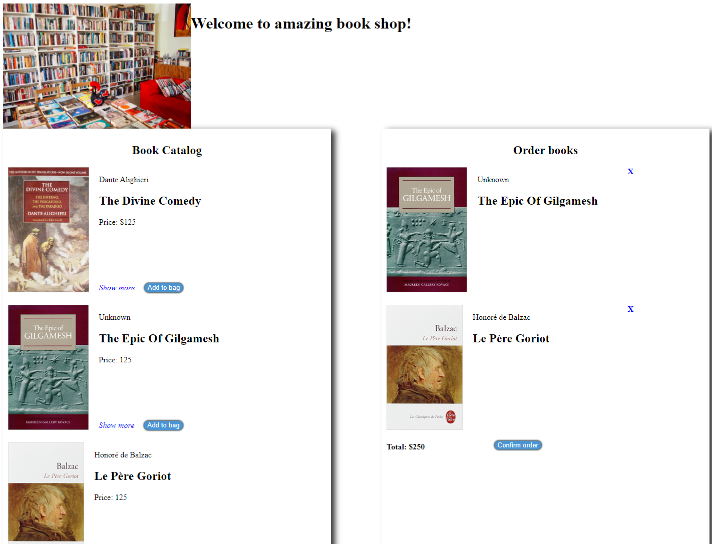
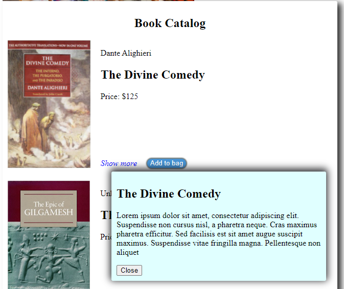

#  Books shop  
1. [Demo](https://DenViRus.github.io/Book-Shop/src/pages/bookShop/bookShop.html)
---
## Task
The books shop owner asked you to create the online shop to buy book with delivery to user's home. He wants the user to be able to look through the books' catalog, see the description of a particular book, add a book to the bag, choose the appropriate date and address to deliver.
## Technical requirements
Compatible browsers: **Google Chrome, Mozilla Firefox**. We primarily develop for Google Chrome. Then we check to see if Mozilla Firefox is breaking our styles.
It's **prohibited** to use CSS frameworks (bootstrap, foundation, etc.).
It's **prohibited** to use JS frameworks (Angular, React, Vue, etc.).
It's **prohibited** to use legacy libraries (jQuery, etc.).
It's **prohibited** to use up-to-date libraries with a set of helper functions (lodash).
It's **allowed** to use icon fonts and CSS preprocessors (SCSS).
It's **recommended** to use [normalize.css](https://necolas.github.io/normalize.css/).
## Repository requirements
- Create a public repository named "book-shop" on your GitHub account.
- You should deploy your task using gh-pages or by any other means.
- The commit history should reflect the development process of the application. Commit names should match the [commit requirements](https://docs.rs.school/#/git-convention)
## Stages of task completion
**Week_1**: Layout of catalog page
 * the page should be created through the JavaScript code. It means, you have html file without tags (if you need, you may add main or div as wrapper, not more).
 * all tags should be created in the js code.
 * styles you should describe in the css file,but you should add css classes to created tags using JavaScript,
 * the delivery form should be implemented in the HTML file ( not thru the js code )
**Week_2**: Add interactive to the pages:
 * add book to the bag by click on appropriate button or by drag the image of book to the bag (drag and drop). Both options should be implemented
 * show popup with book's description by click on Show more button
 * close popup by click on Close or cross button
 * remove book from the bag by the appropriate button,
 * validation of form fields should run after user left the field (blur),
 * summarize the personal information when user clicks on Complete button

### Examples of layout

---